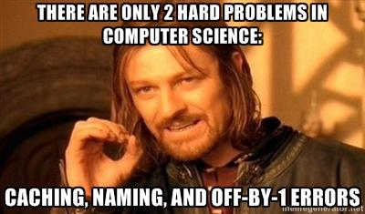

# Naming is Hard

## Purpose

This repo contains lists of names that would be useful when naming a project

|File|Description|
|---|---|
|`server-names.txt`|A list of names between 3 and 7 characters that are easy to say and spell|
|`stars.txt`|The 50 brightest stars|
|`names.txt`|A list of human names|

## Some Other Helpful Links

* https://namingschemes.com/
* [Acme corporation, John Doe, etc](https://en.wikipedia.org/wiki/Placeholder_name)
* [Grover in other languages](https://en.m.wikipedia.org/wiki/Grover#International)
* [Norse Deities](https://simple.wikipedia.org/wiki/List_of_Norse_gods_and_goddesses)
* [Greek and Roman Deities](https://en.m.wikipedia.org/wiki/Interpretatio_graeca)